# Understanding the Orchestration System

Oh My OpenCode's orchestration system transforms a simple AI agent into a coordinated development team. This document explains how the Prometheus → Beads → Agent workflow creates high-quality, reliable code output.

---

## The Core Philosophy

Traditional AI coding tools follow a simple pattern: user asks → AI responds. This works for small tasks but fails for complex work because:

1. **Context overload**: Large tasks exceed context windows
2. **Cognitive drift**: AI loses track of requirements mid-task
3. **Verification gaps**: No systematic way to ensure completeness
4. **Human = Bottleneck**: Requires constant user intervention

The orchestration system solves these problems through **specialization and delegation**.

---

## The Three-Layer Architecture

```mermaid
flowchart TB
    subgraph Planning["Planning Layer (Human + Prometheus)"]
        User[("👤 User")]
        Prometheus["🔥 Prometheus<br/>(Planner)<br/>Claude Opus 4.5"]
        Metis["🦉 Metis<br/>(Consultant)<br/>Claude Opus 4.5"]
        Momus["👁️ Momus<br/>(Reviewer)<br/>GPT-5.2"]
    end
    
    subgraph Tracking["Tracking Layer (Beads Issue Graph)"]
        BeadsCreate["bd create<br/>(Issue Decomposition)"]
        BeadsReady["bd ready<br/>(Unblocked Work)"]
        BeadsClose["bd close<br/>(Completion)"]
    end
    
    subgraph Workers["Worker Layer (Specialized Agents)"]
        Sisyphus["🪨 Sisyphus<br/>(Orchestrator)<br/>Claude Opus 4.5"]
        Oracle["🧠 Oracle<br/>(Architecture)<br/>GPT-5.2"]
        Explore["🔍 Explore<br/>(Codebase Grep)<br/>Grok Code"]
        Librarian["📚 Librarian<br/>(Docs/OSS)<br/>GLM-4.7"]
        Frontend["🎨 Frontend<br/>(UI/UX)<br/>Gemini 3 Pro"]
    end
    
    User -->|"Describe work"| Prometheus
    Prometheus -->|"Consult"| Metis
    Prometheus -->|"Interview"| User
    Prometheus -->|"Decompose plan"| BeadsCreate
    BeadsCreate -->|"High accuracy?"| Momus
    Momus -->|"OKAY / REJECT"| Prometheus
    
    BeadsReady -->|"Pick issue"| Sisyphus
    
    Sisyphus -->|"task(category)"| Workers
    Sisyphus -->|"task(agent)"| Oracle
    Sisyphus -->|"task(agent)"| Explore
    Sisyphus -->|"task(agent)"| Librarian
    Sisyphus -->|"task(agent)"| Frontend
    
    Workers -->|"Results"| BeadsClose
    Oracle -->|"Advice"| Sisyphus
    Explore -->|"Code patterns"| Sisyphus
    Librarian -->|"Documentation"| Sisyphus
    Frontend -->|"UI code"| Sisyphus
```



---

## Layer 1: Planning (Prometheus + Metis + Momus)

### Prometheus: Your Strategic Consultant

Prometheus is **not just a planner** - it's an intelligent interviewer that helps you think through what you actually need.

**The Interview Process:**


**Intent-Specific Strategies:**

Prometheus adapts its interview style based on what you're doing:

| Intent | Prometheus Focus | Example Questions |
|--------|------------------|-------------------|
| **Refactoring** | Safety - behavior preservation | "What tests verify current behavior?" "Rollback strategy?" |
| **Build from Scratch** | Discovery - patterns first | "Found pattern X in codebase. Follow it or deviate?" |
| **Mid-sized Task** | Guardrails - exact boundaries | "What must NOT be included? Hard constraints?" |
| **Architecture** | Strategic - long-term impact | "Expected lifespan? Scale requirements?" |

### Metis: The Gap Analyzer

Before Prometheus finalizes the plan, **Metis catches what Prometheus missed**:

- Hidden intentions in user's request
- Ambiguities that could derail implementation
- AI-slop patterns (over-engineering, scope creep)
- Missing acceptance criteria
- Edge cases not addressed

**Why Metis Exists:**

The plan author (Prometheus) has "ADHD working memory" - it makes connections that never make it onto the page. Metis forces externalization of implicit knowledge.

### Momus: The Ruthless Reviewer

For high-accuracy mode, Momus validates plans against **four core criteria**:

1. **Clarity**: Does each issue specify WHERE to find implementation details?
2. **Verification**: Are acceptance criteria concrete and measurable?
3. **Context**: Is there sufficient context to proceed without >10% guesswork?
4. **Big Picture**: Is the purpose, background, and workflow clear?

**The Momus Loop:**

Momus only says "OKAY" when:
- 100% of file references verified
- ≥80% of issues have clear reference sources
- ≥90% of issues have concrete acceptance criteria
- Zero issues require assumptions about business logic
- Zero critical red flags

If REJECTED, Prometheus fixes issues and resubmits. **No maximum retry limit.**

---

## Layer 2: Tracking (Beads Issue Graph)

### Why Beads Over Plan Files

The legacy approach used `.sisyphus/plans/*.md` files and `boulder.json` for state tracking. Beads replaces this with a proper issue graph:

| Aspect | Legacy Plan Files | Beads |
|--------|------------------|-------|
| **State** | `boulder.json` (fragile) | `.beads/` (git-synced) |
| **Dependencies** | Implicit task ordering | Explicit `bd dep add` |
| **Resumability** | `/start-work` reads boulder | `bd ready` shows unblocked work |
| **Visibility** | Read plan file manually | `bd ready`, `bd blocked`, `bd stats` |
| **Granularity** | Monolithic plan | Individual issues with metadata |

### The Beads Lifecycle


### Dependency Graph

```
[Build Frontend]    ──┐
                      ├──→ [Integration Tests] ──→ [Deploy]
[Build Backend]     ──┘
```

```bash
bd create --title="Build frontend"    --type=task    # beads-001
bd create --title="Build backend"     --type=task    # beads-002
bd create --title="Integration tests" --type=task    # beads-003
bd create --title="Deploy"            --type=task    # beads-004
bd dep add beads-003 beads-001   # tests depend on frontend
bd dep add beads-003 beads-002   # tests depend on backend
bd dep add beads-004 beads-003   # deploy depends on tests
```

---

## Layer 3: Workers (Specialized Agents)

### Sisyphus: The Orchestrator

Sisyphus is the **conductor** that coordinates work. Key characteristics:

- **Delegates**: Routes work to specialized agents via `task(category, ...)`
- **Verifies**: Runs `lsp_diagnostics`, test suites, reads changed files
- **Tracks**: Uses beads to manage issue lifecycle

**What Sisyphus CAN do:**
- ✅ Read files to understand context
- ✅ Run commands to verify results
- ✅ Use lsp_diagnostics to check for errors
- ✅ Search patterns with grep/glob/ast-grep
- ✅ Manage beads issues (`bd update`, `bd close`)

**What Sisyphus MUST delegate:**
- ❌ Writing/editing code files
- ❌ Fixing bugs
- ❌ Creating tests
- ❌ Git commits

### Wisdom Accumulation

The power of orchestration is **cumulative learning**. After each issue:

1. Extract learnings from subagent's response
2. Categorize into: Conventions, Successes, Failures, Gotchas, Commands
3. Pass forward to ALL subsequent subagents

This prevents repeating mistakes and ensures consistent patterns.

### Parallel Execution

Independent issues (no dependency relationship) can run in parallel:

```typescript
// Sisyphus identifies parallelizable issues from beads graph
// beads-001 and beads-002 have no shared dependencies
task(category="ultrabrain", prompt="Implement beads-001...")
task(category="visual-engineering", prompt="Implement beads-002...")
// Both run simultaneously
```

---

## The task Tool: Category + Skill System

### Why Categories are Revolutionary

**The Problem with Model Names:**

```typescript
// OLD: Model name creates distributional bias
task(agent="gpt-5.2", prompt="...")  // Model knows its limitations
task(agent="claude-opus-4.6", prompt="...")  // Different self-perception
```

**The Solution: Semantic Categories:**

```typescript
// NEW: Category describes INTENT, not implementation
task(category="ultrabrain", prompt="...")     // "Think strategically"
task(category="visual-engineering", prompt="...")  // "Design beautifully"
task(category="quick", prompt="...")          // "Just get it done fast"
```

### Built-in Categories

| Category | Model | When to Use |
|----------|-------|-------------|
| `visual-engineering` | Gemini 3 Pro | Frontend, UI/UX, design, styling, animation |
| `ultrabrain` | GPT-5.2 Codex (xhigh) | Deep logical reasoning, complex architecture decisions |
| `artistry` | Gemini 3 Pro (max) | Highly creative/artistic tasks, novel ideas |
| `quick` | Claude Haiku 4.5 | Trivial tasks - single file changes, typo fixes |
| `unspecified-low` | Claude Sonnet 4.5 | Tasks that don't fit other categories, low effort |
| `unspecified-high` | Claude Opus 4.5 (max) | Tasks that don't fit other categories, high effort |
| `writing` | Gemini 3 Flash | Documentation, prose, technical writing |

### Custom Categories

You can define your own categories:

```json
// .opencode/oh-my-opencode.json
{
  "categories": {
    "unity-game-dev": {
      "model": "openai/gpt-5.2",
      "temperature": 0.3,
      "prompt_append": "You are a Unity game development expert..."
    }
  }
}
```

### Skills: Domain-Specific Instructions

Skills prepend specialized instructions to subagent prompts:

```typescript
// Category + Skill combination
task(
  category="visual-engineering", 
  load_skills=["frontend-ui-ux"],  // Adds UI/UX expertise
  prompt="..."
)

task(
  category="general",
  load_skills=["playwright"],  // Adds browser automation expertise
  prompt="..."
)
```

**Example Evolution:**

| Before | After |
|--------|-------|
| Hardcoded: `frontend-ui-ux-engineer` (Gemini 3 Pro) | `category="visual-engineering" + load_skills=["frontend-ui-ux"]` |
| One-size-fits-all | `category="visual-engineering" + load_skills=["unity-master"]` |
| Model bias | Category-based: model abstraction eliminates bias |

---

## The Execution Workflow


---

## Why This Architecture Works

### 1. Separation of Concerns

- **Planning** (Prometheus): High reasoning, interview, strategic thinking
- **Tracking** (Beads): Issue graph, dependency resolution, cross-session state
- **Execution** (Sisyphus + Workers): Focused implementation, no distractions

### 2. Explicit Over Implicit

Every worker prompt includes:
- Exact issue from beads
- Clear success criteria
- Forbidden actions
- All accumulated wisdom
- Reference files with line numbers

No assumptions. No guessing.

### 3. Trust But Verify

Sisyphus **never trusts subagent claims**:
- Runs `lsp_diagnostics` at project level
- Executes full test suite
- Reads actual file changes
- Cross-references requirements

### 4. Model Optimization

Expensive models (Opus, GPT-5.2) used only where needed:
- Planning decisions (once per project)
- Debugging consultation (rare)
- Complex architecture (rare)

Bulk work goes to cost-effective models (Sonnet, Haiku, Flash).

---

## Getting Started

1. **Enter Prometheus Mode**: Press **Tab** at the prompt
2. **Describe Your Work**: "I want to add user authentication to my app"
3. **Answer Interview Questions**: Prometheus will ask about patterns, preferences, constraints
4. **Review Issues**: Run `bd ready` to see the decomposed work with dependencies
5. **Execute**: Pick issues with `bd update <id> --status in_progress`, implement, `bd close <id>`
6. **Observe**: Watch issues complete with verification
7. **Done**: All issues closed, code verified, ready to ship

---

## Further Reading

- [Overview](./overview.md) - Quick start guide
- [Ultrawork Manifesto](../ultrawork-manifesto.md) - Philosophy behind the system
- [Installation Guide](./installation.md) - Detailed installation instructions
- [Configuration](../configurations.md) - Customize the orchestration
