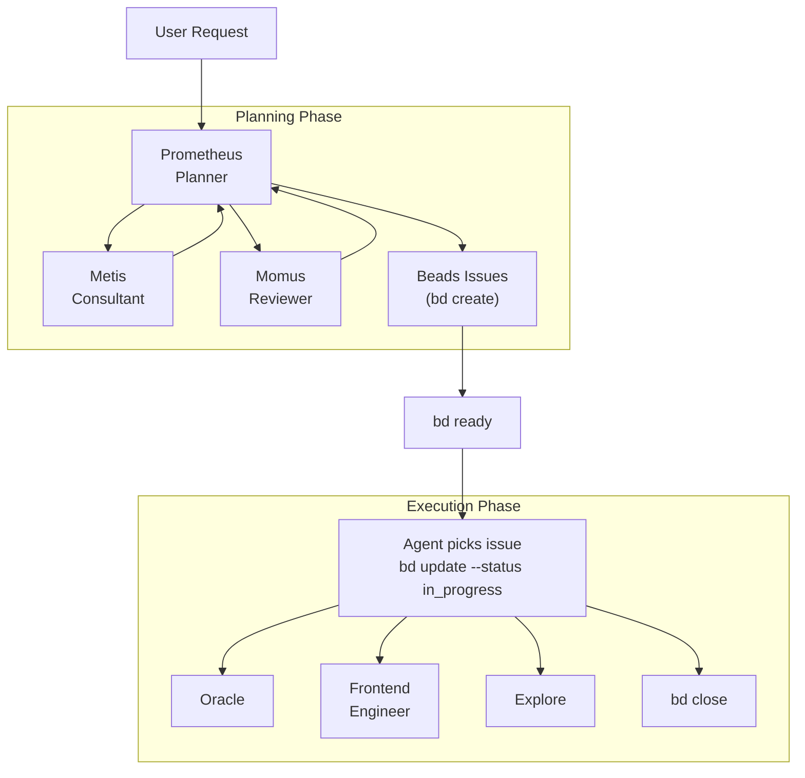

# Oh-My-OpenCode Orchestration Guide

## TL;DR - When to Use What

| Complexity | Approach | When to Use |
|------------|----------|-------------|
| **Simple** | Just prompt | Simple tasks, quick fixes, single-file changes |
| **Complex + Lazy** | Just type `ulw` or `ultrawork` | Complex tasks where explaining context is tedious. Agent figures it out. |
| **Complex + Tracked** | Beads-driven workflow | Multi-step work requiring dependency tracking and cross-session continuity. Use `bd create` → `bd ready` → `bd close`. |
| **Complex + Precise** | `@plan` → beads execution | Precise, multi-step work requiring planning. Prometheus plans, then work is tracked and executed via beads issues. |

**Decision Flow:**

```
Is it a quick fix or simple task?
  └─ YES → Just prompt normally
  └─ NO  → Is explaining the full context tedious?
             └─ YES → Type "ulw" and let the agent figure it out
             └─ NO  → Do you need tracked, verifiable execution?
                        └─ YES → Use beads: bd create issues, track with bd ready/update/close
                        └─ NO  → Just use "ulw"
```

---

This document provides a comprehensive guide to the orchestration system that implements Oh-My-OpenCode's core philosophy: **"Separation of Planning and Execution"**.

## 1. Overview

Traditional AI agents often mix planning and execution, leading to context pollution, goal drift, and AI slop (low-quality code).

Oh-My-OpenCode solves this by clearly separating two roles:

1. **Prometheus (Planner)**: A pure strategist who never writes code. Establishes perfect plans through interviews and analysis.
2. **Beads-Driven Execution**: Work is decomposed into trackable issues with dependencies, executed via `bd` CLI. The issue graph provides cross-session continuity, dependency ordering, and progress visibility.

---

## 2. Planning: Prometheus and @plan

### Method 1: Switch to Prometheus Agent (Tab → Select Prometheus)

```
1. Press Tab at the prompt
2. Select "Prometheus" from the agent list
3. Describe your work: "I want to refactor the auth system"
4. Answer interview questions
5. Prometheus creates a plan; work is decomposed into beads issues
```

### Method 2: Use @plan Command (in Sisyphus)

```
1. Stay in Sisyphus (default agent)
2. Type: @plan "I want to refactor the auth system"
3. The @plan command automatically switches to Prometheus
4. Answer interview questions
5. Plan output is captured; issues are created via bd create
```

### Which Should You Use?

| Scenario | Recommended Method | Why |
|----------|-------------------|-----|
| **New session, starting fresh** | Switch to Prometheus agent | Clean mental model - you're entering "planning mode" |
| **Already in Sisyphus, mid-work** | Use @plan | Convenient, no agent switch needed |
| **Want explicit control** | Switch to Prometheus agent | Clear separation of planning vs execution contexts |
| **Quick planning interrupt** | Use @plan | Fastest path from current context |

**Key Insight**: Both methods trigger the same Prometheus planning flow. The @plan command is simply a convenience shortcut.

---

## 3. Beads-Driven Execution

After planning, work is tracked and executed through the **beads issue graph**. This replaces the legacy plan-file + `/start-work` + `boulder.json` workflow.

### Starting Work

```bash
bd ready                              # Find issues with no blockers
bd show <id>                          # Review issue details
bd update <id> --status in_progress   # Claim work
# ... implement the work ...
bd close <id>                         # Mark complete
```

### Session Continuity

Beads issues persist in `.beads/` and sync with git. Session interruptions don't lose progress:

```
Monday 9:00 AM
  └─ @plan "Build user authentication"
  └─ Prometheus interviews and creates plan
  └─ Issues created via bd create (with dependencies)
  └─ bd ready → pick first available issue
  └─ bd update <id> --status in_progress
  └─ Work on issue, close it
  └─ [Session ends - computer crash, user logout, etc.]

Monday 2:00 PM (NEW SESSION)
  └─ bd ready → see remaining issues (dependencies resolved automatically)
  └─ Continue from where you left off
```

### Dependency Tracking

```bash
bd create --title="Build frontend"  --type=task      # beads-001
bd create --title="Build backend"   --type=task      # beads-002
bd create --title="Integration tests" --type=task    # beads-003
bd dep add beads-003 beads-001   # tests depend on frontend
bd dep add beads-003 beads-002   # tests depend on backend

bd ready          # Shows beads-001, beads-002 (no blockers)
bd blocked        # Shows beads-003 (blocked by 001, 002)
```

### Why Beads Over Plan Files

| Aspect | Legacy Plan Files | Beads |
|--------|------------------|-------|
| **Persistence** | `.sisyphus/plans/*.md` + `boulder.json` | `.beads/` directory, git-synced |
| **Dependencies** | Implicit (task ordering) | Explicit (`bd dep add`) |
| **Cross-session** | `boulder.json` state | Issue status persists naturally |
| **Visibility** | Read plan file manually | `bd ready`, `bd blocked`, `bd stats` |
| **Granularity** | Monolithic plan file | Individual trackable issues |

---

## 4. Execution Modes: Hephaestus vs Sisyphus+ultrawork

Another common question: **When should I use Hephaestus vs just typing `ulw` in Sisyphus?**

### Quick Comparison

| Aspect | Hephaestus | Sisyphus + `ulw` / `ultrawork` |
|--------|-----------|-------------------------------|
| **Model** | GPT-5.2 Codex (medium reasoning) | Claude Opus 4.5 (your default) |
| **Approach** | Autonomous deep worker | Keyword-activated ultrawork mode |
| **Best For** | Complex architectural work, deep reasoning | General complex tasks, "just do it" scenarios |
| **Planning** | Self-plans during execution | Uses Prometheus plans or beads issues if available |
| **Delegation** | Heavy use of explore/librarian agents | Uses category-based delegation |
| **Temperature** | 0.1 | 0.1 |

### When to Use Hephaestus

Switch to Hephaestus (Tab → Select Hephaestus) when:

1. **Deep architectural reasoning needed**
   - "Design a new plugin system"
   - "Refactor this monolith into microservices"

2. **Complex debugging requiring inference chains**
   - "Why does this race condition only happen on Tuesdays?"
   - "Trace this memory leak through 15 files"

3. **Cross-domain knowledge synthesis**
   - "Integrate our Rust core with the TypeScript frontend"
   - "Migrate from MongoDB to PostgreSQL with zero downtime"

4. **You specifically want GPT-5.2 Codex reasoning**
   - Some problems benefit from GPT-5.2's training characteristics

**Example:**
```
[Switch to Hephaestus]
"I need to understand how data flows through this entire system
and identify all the places where we might lose transactions.
Explore thoroughly before proposing fixes."
```

### When to Use Sisyphus + `ulw` / `ultrawork`

Use the `ulw` keyword in Sisyphus when:

1. **You want the agent to figure it out**
   - "ulw fix the failing tests"
   - "ulw add input validation to the API"

2. **Complex but well-scoped tasks**
   - "ulw implement JWT authentication following our patterns"
   - "ulw create a new CLI command for deployments"

3. **You're feeling lazy** (officially supported use case)
   - Don't want to write detailed requirements
   - Trust the agent to explore and decide

4. **You want to leverage existing plans or beads issues**
   - If beads issues exist, `ulw` mode can reference them
   - Falls back to autonomous exploration if no tracked work

**Example:**
```
[Stay in Sisyphus]
"ulw refactor the user service to use the new repository pattern"

[Agent automatically:]
- Explores existing codebase patterns
- Implements the refactor
- Runs verification (tests, typecheck)
- Reports completion
```

### Key Difference in Practice

| Hephaestus | Sisyphus + ulw |
|------------|----------------|
| You manually switch to Hephaestus agent | You type `ulw` in any Sisyphus session |
| GPT-5.2 Codex with medium reasoning | Your configured default model |
| Optimized for autonomous deep work | Optimized for general execution |
| Always uses explore-first approach | Respects existing beads issues if available |
| "Smart intern that needs no supervision" | "Smart intern that follows your workflow" |

### Recommendation

**For most users**: Use `ulw` keyword in Sisyphus. It's the default path and works excellently for 90% of complex tasks.

**For power users**: Switch to Hephaestus when you specifically need GPT-5.2 Codex's reasoning style or want the "AmpCode deep mode" experience of fully autonomous exploration and execution.

---

## 5. Overall Architecture



---

## 6. Key Components

### 🔮 Prometheus (The Planner)

- **Model**: `anthropic/claude-opus-4-6`
- **Role**: Strategic planning, requirements interviews, work decomposition into beads issues
- **Constraint**: **READ-ONLY**. Can only create/modify markdown files within `.sisyphus/` directory and create beads issues.
- **Characteristic**: Never writes code directly, focuses solely on "how to do it".

### 🦉 Metis (The Plan Consultant)

- **Role**: Pre-analysis and gap detection
- **Function**: Identifies hidden user intent, prevents AI over-engineering, eliminates ambiguity.
- **Workflow**: Metis consultation is mandatory before plan creation.

### ⚖️ Momus (The Plan Reviewer)

- **Role**: High-precision plan validation (High Accuracy Mode)
- **Function**: Rejects and demands revisions until the plan is perfect.
- **Trigger**: Activated when user requests "high accuracy".

### ⚡ Beads Execution

- **Tool**: `bd` CLI (beads issue tracker)
- **Role**: Work tracking, dependency management, cross-session continuity
- **Characteristic**: Issues form a dependency graph. `bd ready` surfaces unblocked work. `bd close` marks completion and unblocks dependents.

---

## 7. Workflow

### Phase 1: Interview and Planning (Interview Mode)

Prometheus starts in **interview mode** by default. Instead of immediately creating a plan, it collects sufficient context.

1. **Intent Identification**: Classifies whether the user's request is Refactoring or New Feature.
2. **Context Collection**: Investigates codebase and external documentation through `explore` and `librarian` agents.
3. **Draft Creation**: Continuously records discussion content in `.sisyphus/drafts/`.

### Phase 2: Plan Generation & Issue Decomposition

When the user requests "Make it a plan", plan generation begins.

1. **Metis Consultation**: Confirms any missed requirements or risk factors.
2. **Plan Creation**: Writes a plan document and decomposes work into beads issues via `bd create`, with dependencies established via `bd dep add`.
3. **Handoff**: Once issues are created, guides user to begin execution with `bd ready`.

### Phase 3: Execution

Work proceeds through the beads issue graph:

1. **Find Work**: `bd ready` shows issues with no unresolved blockers.
2. **Claim Work**: `bd update <id> --status in_progress`.
3. **Execute**: Agent or user implements the work, delegating to specialized agents as needed.
4. **Complete**: `bd close <id>` marks done and unblocks dependent issues.
5. **Continuity**: Even if the session is interrupted, `bd ready` in a new session shows remaining work.

---

## 8. Commands and Usage

### `@plan [request]`

Invokes Prometheus to start a planning session from Sisyphus.

- Example: `@plan "I want to refactor the authentication system to NextAuth"`
- Effect: Routes to Prometheus, then returns to Sisyphus when planning completes

### `bd ready` / `bd update` / `bd close`

The primary execution workflow:

- **`bd ready`**: Lists issues with no blockers, ready to work on
- **`bd update <id> --status in_progress`**: Claim an issue
- **`bd close <id>`**: Mark an issue complete

### `/start-work` (Legacy Fallback)

> **Legacy**: This command uses `.sisyphus/plans/` and `boulder.json` for plan-file orchestration. Prefer the beads workflow above.

- **Fresh session**: Finds plan in `.sisyphus/plans/` and enters execution mode
- **Existing boulder**: Resumes from where you left off (reads boulder.json)
- **Effect**: Automatically switches to Atlas agent if not already active

### Switching Agents Manually

Press `Tab` at the prompt to see available agents:

| Agent | When to Switch |
|-------|---------------|
| **Prometheus** | You want to create a detailed work plan |
| **Hephaestus** | You need GPT-5.2 Codex for deep autonomous work |
| **Sisyphus** | Return to default agent for normal prompting |

---

## 9. Configuration Guide

You can control related features in `oh-my-opencode.json`.

```jsonc
{
  "sisyphus_agent": {
    "disabled": false,           // Enable orchestration (default: false)
    "planner_enabled": true,     // Enable Prometheus (default: true)
    "replace_plan": true         // Replace default plan agent with Prometheus (default: true)
  },
  
  // Hook settings (add to disable)
  "disabled_hooks": [
    // "start-work",             // Disable legacy execution trigger
    // "prometheus-md-only"      // Remove Prometheus write restrictions (not recommended)
  ]
}
```

---

## 10. Best Practices

1. **Don't Rush Planning**: Invest sufficient time in the interview with Prometheus. The more precise the issue decomposition, the faster the execution.

2. **Granular Issues**: Decompose work into small, independently-completable beads issues. Each issue should be achievable in a single focused session.

3. **Use Dependencies**: Establish `bd dep add` relationships to ensure correct execution order. `bd ready` automatically surfaces unblocked work.

4. **Trust Beads Continuity**: Don't worry about session interruptions. `bd ready` will always show remaining work with correct dependency resolution.

5. **Use `ulw` for Convenience**: When in doubt, type `ulw` and let the system figure out the best approach.

6. **Reserve Hephaestus for Deep Work**: Don't overthink agent selection. Hephaestus shines for genuinely complex architectural challenges.

---

## 11. Troubleshooting Common Confusions

### "I switched to Prometheus but nothing happened"

Prometheus enters **interview mode** by default. It will ask you questions about your requirements. Answer them, then say "make it a plan" when ready.

### "bd ready shows no issues"

Either:
- No issues have been created → Create them with `bd create` or use Prometheus to decompose work
- All issues are blocked → Run `bd blocked` to see what's blocking them
- All issues are closed → Run `bd list --status=closed` to verify

### "How do I resume work from a previous session?"

Run `bd ready` in any new session. It shows all issues with no unresolved blockers, regardless of which session created them.

### "What's the difference between @plan and just switching to Prometheus?"

**Nothing functional.** Both invoke Prometheus. @plan is a convenience command while switching agents is explicit control. Use whichever feels natural.

### "Should I use Hephaestus or type ulw?"

**For most tasks**: Type `ulw` in Sisyphus.

**Use Hephaestus when**: You specifically need GPT-5.2 Codex's reasoning style for deep architectural work or complex debugging.

### "Can I still use /start-work and boulder.json?"

Yes, as a **legacy fallback**. The `/start-work` command and `.sisyphus/plans/` workflow still function for backward compatibility. However, beads-driven execution (`bd ready` → `bd update` → `bd close`) is the recommended approach.
